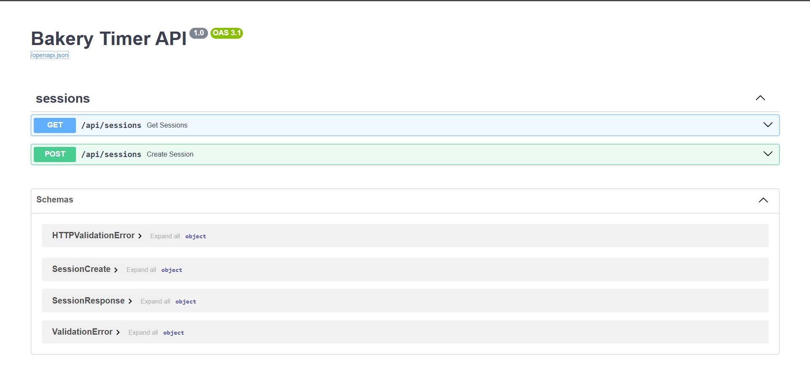

# 🍰 Bakery Timer

A local productivity app that gamifies focus sessions using a baking metaphor. Select a cake type, start the countdown, and build a history of completed sessions — like Pomodoro, but more delicious.

Built as a full-stack upgrade of an academic prototype, replacing browser localStorage with a REST API backend and persistent SQLite database.

---

## Features

- 🍪 Preset cake types: Cookie (10 min), Cupcake (20 min), Bread (40 min)
- ⏱️ Custom session name and duration
- ⏸️ Pause, resume, and cancel timer
- 🔔 Audio notification on session complete
- 📋 Session history — persists across browser refreshes and app restarts
- 📖 Auto-generated API docs at `/docs`

---

## Tech stack

| Layer | Technology |
|-------|-----------|
| Backend | FastAPI (Python) |
| Database | SQLite via SQLAlchemy ORM |
| Validation | Pydantic v2 |
| Server | uvicorn |
| Frontend | Vanilla HTML / CSS / JavaScript |
| Testing | pytest + httpx |

---

## Prerequisites

- Python 3.10+
- pip

---

## Quick start

**1. Clone the repository**

```bash
git clone https://github.com/H2SbF7/Bakery-Timer.git
cd bakery-timer
```

**2. Create and activate a virtual environment**

```bash
# Windows
python -m venv .venv
.venv\Scripts\activate

# macOS / Linux
python -m venv .venv
source .venv/bin/activate
```

**3. Install dependencies**

```bash
pip install -r requirements.txt
```

**4. Start the server**

```bash
uvicorn backend.main:app --reload
```

**5. Open the app**

Visit `http://localhost:8000` in your browser.

The SQLite database (`bakery_timer.db`) is created automatically on first run, so no setup required.

---

## API

The REST API is available at `http://localhost:8000/api`.

| Method | Endpoint | Description |
|--------|----------|-------------|
| `POST` | `/api/sessions` | Save a completed session |
| `GET` | `/api/sessions` | Retrieve all sessions |

Interactive API documentation (Swagger UI) is auto-generated at:

```
http://localhost:8000/docs
```



---

## Project structure

```
bakery-timer/
├── backend/
│   ├── main.py           # FastAPI app, middleware, static files
│   ├── database.py       # SQLAlchemy engine and session factory
│   ├── models.py         # ORM models
│   ├── schemas.py        # Pydantic request/response schemas
│   └── routes/
│       └── sessions.py   # API route handlers
├── frontend/
│   ├── index.html
│   └── assets/
│       ├── styles/
│       ├── scripts/
│       ├── images/
│       └── audios/
├── tests/
│   ├── conftest.py       # pytest fixtures and test DB setup
│   └── test_sessions.py  # API endpoint tests
├── docs/                 # Project documentation (SDLC artifacts)
├── requirements.txt
└── README.md
```

---

## Running tests

```bash
python -m pytest tests/ -v
```

Expected output: 11 tests covering `POST /api/sessions` and `GET /api/sessions` — happy path and validation error cases.

---

## Documentation

Full SDLC documentation is available in the `docs/` folder:

| Document | Description |
|----------|-------------|
| `PROJECT_CHARTER.md` | Project goals, scope, and constraints |
| `REQUIREMENTS.md` | Functional and non-functional requirements |
| `SYSTEM_DESIGN.md` | Architecture, folder structure, state machine |
| `API_SPEC.md` | REST API specification with request/response examples |
| `DB_SCHEMA.md` | Database schema and SQLAlchemy models |
| `TEST_PLAN.md` | Test strategy, automated and manual test cases |

---

## Author

Huỳnh Ngọc Mẫn
Building toward a career in AI / ML / Data Science.

[GitHub](https://github.com/H2SbF7) · [LinkedIn](https://www.linkedin.com/in/man-huynh-181627331)